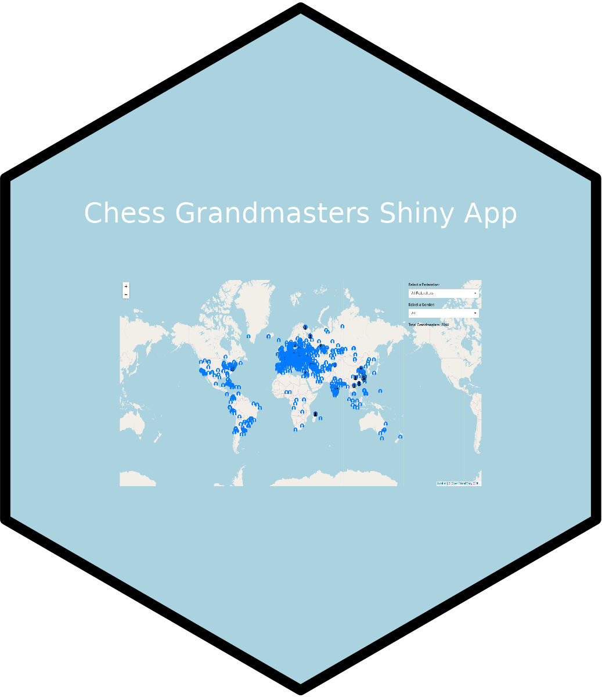
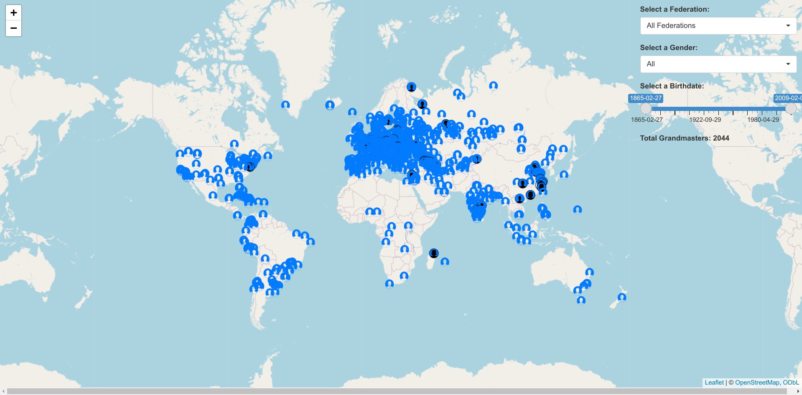

<h2 align="center"> Chess Grandmaster App ♟️</h2>

This Shiny app allows you to explore and filter grandmasters' birthplaces on the map. Hold your pointer over the icons to view names, and click to see a pop-up with additional information.

### Features

- **Welcome pop-up**: Welcome pop up with information about app.
- **Filter by Federation**: Select a specific chess federation or view grandmasters from all federations.
- **Filter by Gender**: Choose to display male, female, or all grandmasters.
- **Filter by Birthdate**: Select a range of birth dates.
- **Interactive Map**: Explore the birthplaces of grandmasters on the map with clickable markers.
- **Data Summary**: Check the total number of grandmasters based on your selected filters.
- **Disconnect Message**: Receive a notification if there is a disconnection from the app.
- **Data Not Avaiable Pop-up**: Pop up if data is not avaiable for selected inputs.

[Explore the Chess Grandmaster App](https://aswanijahangeer.shinyapps.io/chess_grandmasters_shinyapp/)

## Screenshots

## Technologies Used

- [Shiny](https://shiny.rstudio.com/): R package for building interactive web applications.
- [Leaflet](https://rstudio.github.io/leaflet/): An open-source JavaScript library for interactive maps.
- [ChessGMsdata](https://github.com/aswanijehangeer/ChessGMsdata): An open-source R data package for chess grandmasters data.

Feel free to contribute, report issues, or suggest improvements!
